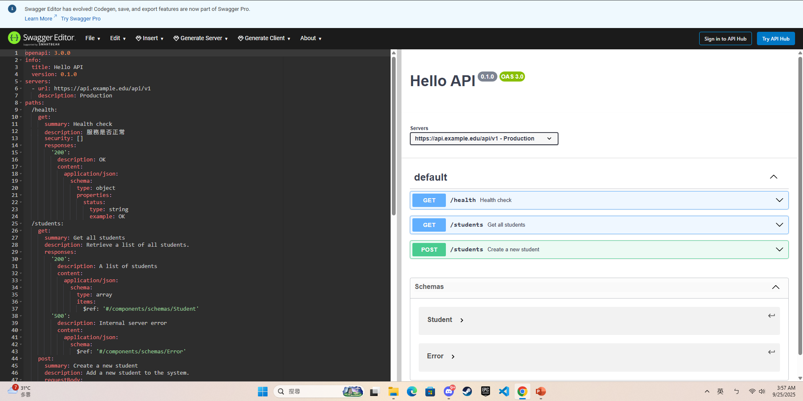
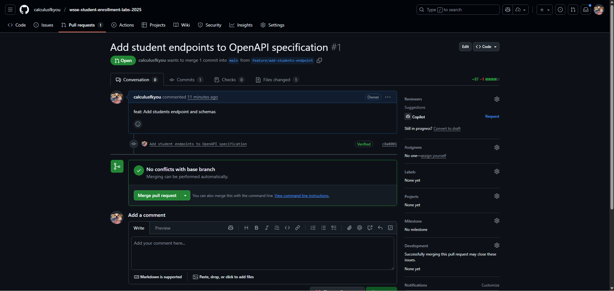
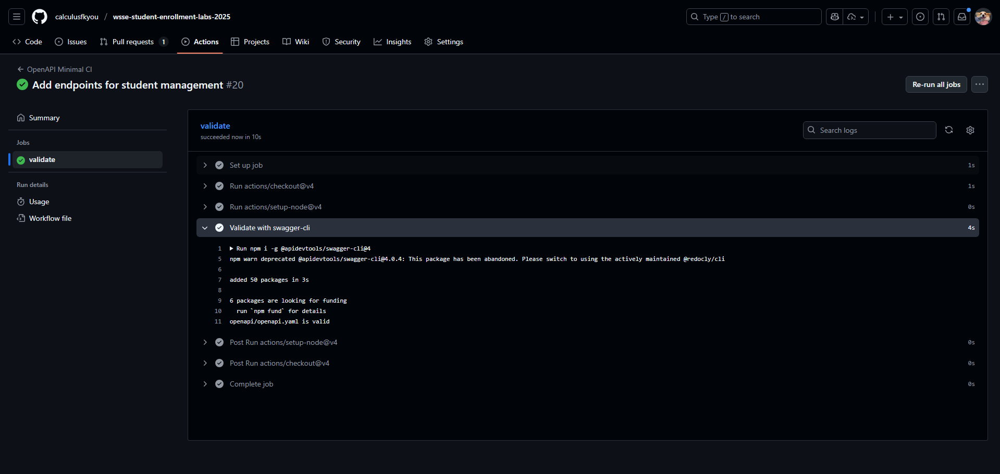

1. Repo連結：https://github.com/calculusfkyou/wsse-student-enrollment-labs-2025
2. PR連結：https://github.com/calculusfkyou/wsse-student-enrollment-labs-2025/pull/1
3. Swagger Editor截圖：  
   
4. PR綠燈截圖：  
   
5. CI內容截圖：  
   
6. 重點片段連結：  
   [/health](https://github.com/calculusfkyou/wsse-student-enrollment-labs-2025/blob/feature/add-students-endpoint/openapi/openapi.yaml#L10-L23)  
   [GET /students](https://github.com/calculusfkyou/wsse-student-enrollment-labs-2025/blob/feature/add-students-endpoint/openapi/openapi.yaml#L25-L42)  
   [POST /students](https://github.com/calculusfkyou/wsse-student-enrollment-labs-2025/blob/feature/add-students-endpoint/openapi/openapi.yaml#L43-L76)  
   [Student schema](https://github.com/calculusfkyou/wsse-student-enrollment-labs-2025/blob/feature/add-students-endpoint/openapi/openapi.yaml#L33-L36)  
   [Error schema](https://github.com/calculusfkyou/wsse-student-enrollment-labs-2025/blob/feature/add-students-endpoint/openapi/openapi.yaml#L41-L42)  
7. ApiKey占位與/health覆寫的片段連結：  
   [ApiKey 佔位](https://github.com/calculusfkyou/wsse-student-enrollment-labs-2025/blob/feature/add-students-endpoint/openapi/openapi.yaml#L78-L82)  
   [/health 中的 security 覆寫](https://github.com/calculusfkyou/wsse-student-enrollment-labs-2025/blob/feature/add-students-endpoint/openapi/openapi.yaml#L14)
