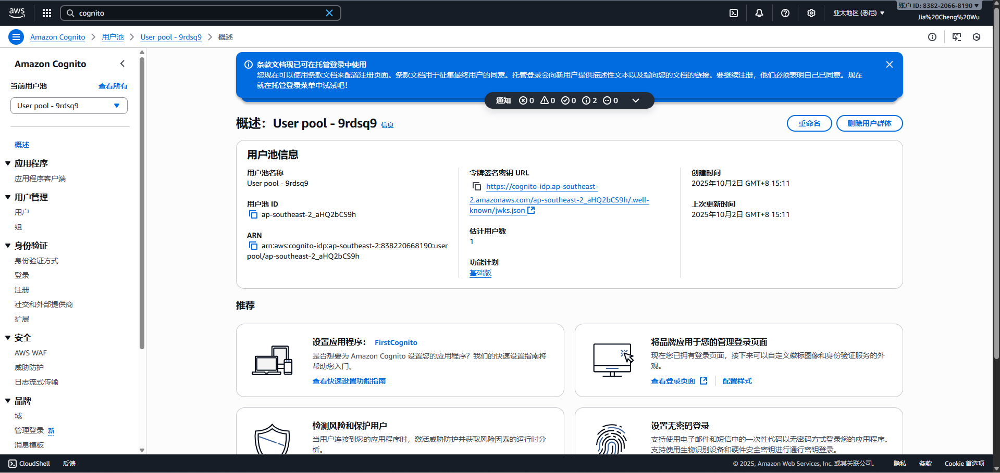
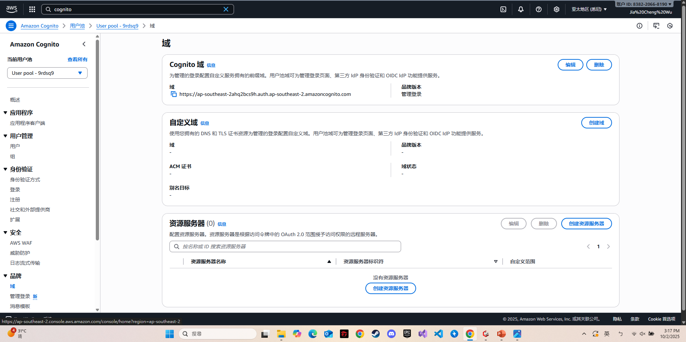
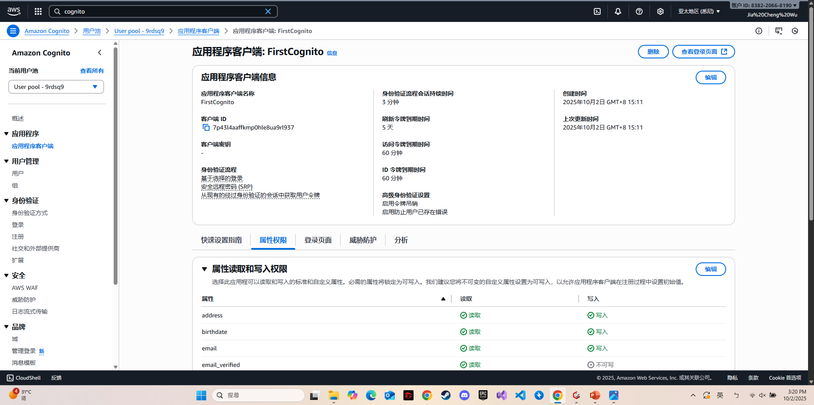
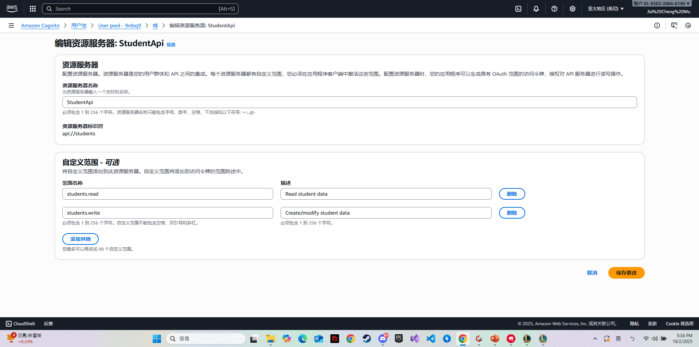
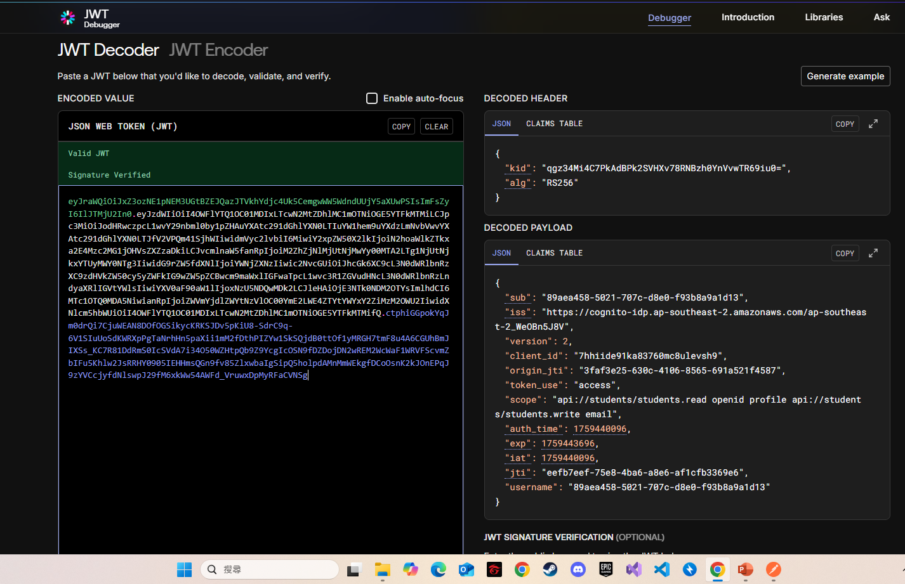
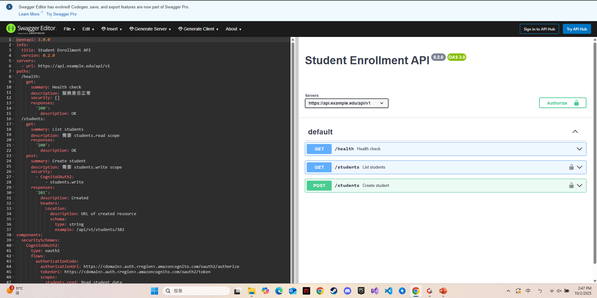
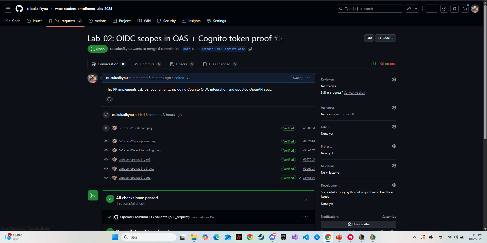

1. Repo 連結：  https://github.com/calculusfkyou/wsse-student-enrollment-labs-2025/tree/feature/lab02-cognito-oidc
2. PR 連結：  [#1](https://github.com/calculusfkyou/wsse-student-enrollment-labs-2025/pull/2)
3. OAS 檔案路徑：  [openapi/openapi.yaml](https://github.com/calculusfkyou/wsse-student-enrollment-labs-2025/blob/feature/lab02-cognito-oidc/openapi/openapi.yaml)

### 01-cognito-pool.png  
  

### 02-cognito-domain.png  
  

### 03-cognito-appclient.png  
  

### 04-cognito-scopes.png  
  

### 05-jwt-access-claims.png  
  

### 06-editor-no-errors.png  
  

### 07-pr-ci-green.png  

