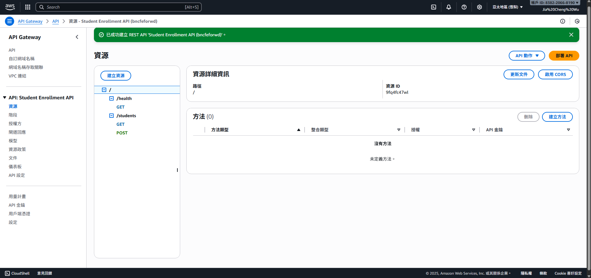
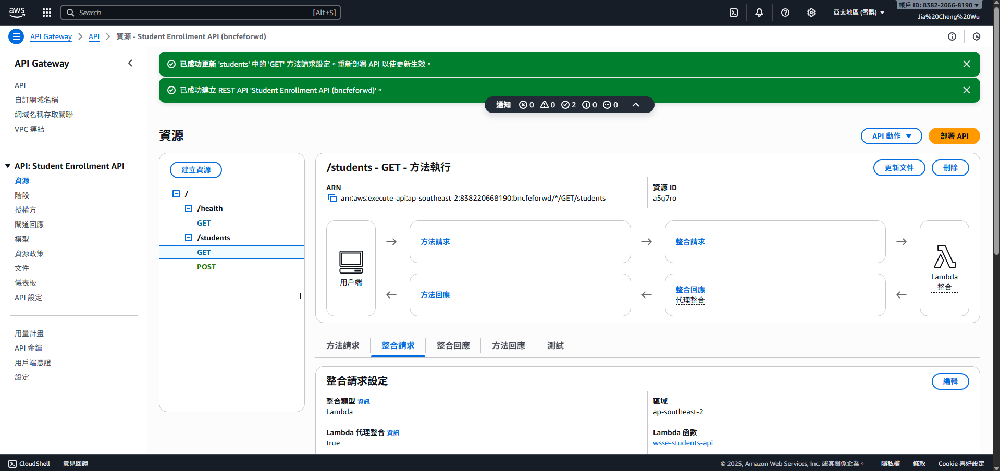
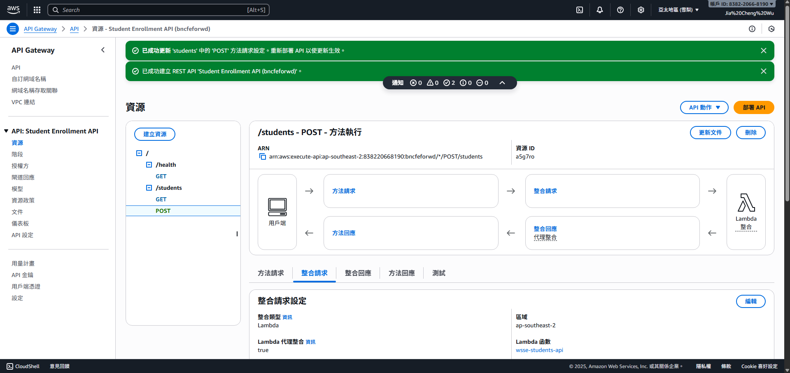
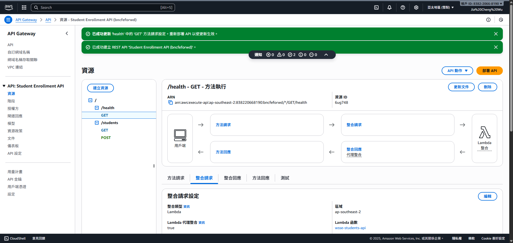
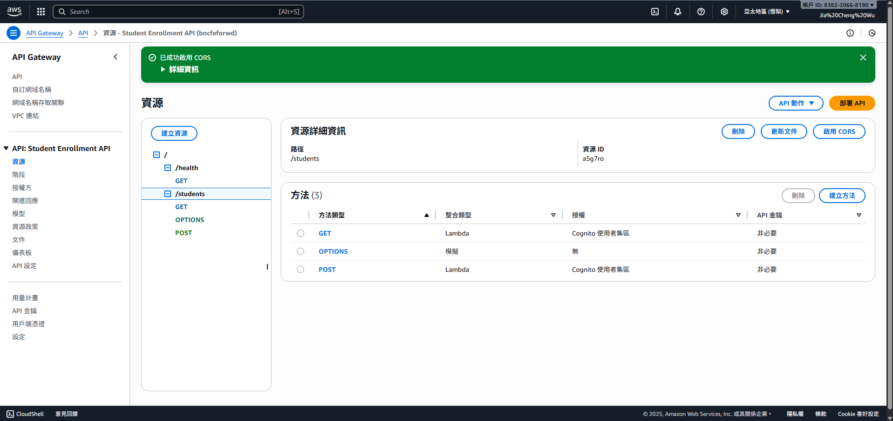
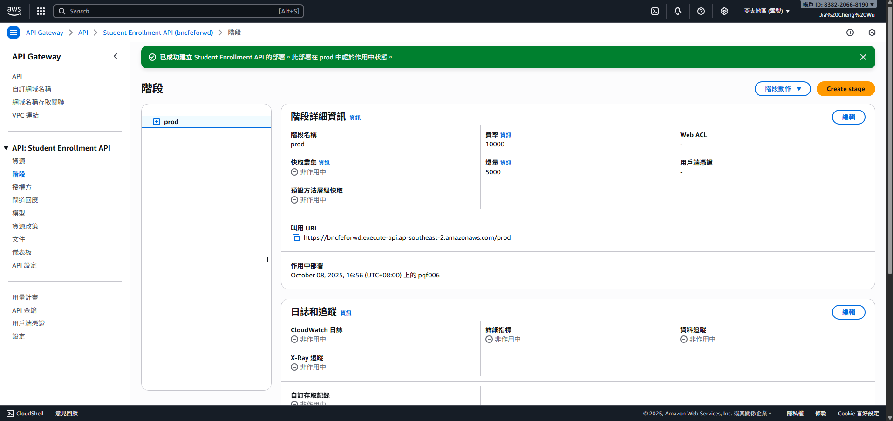
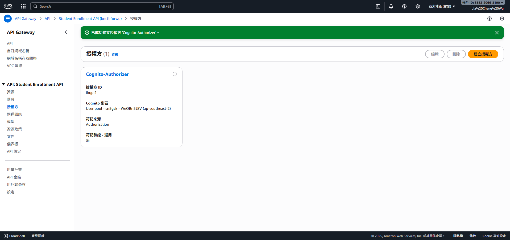
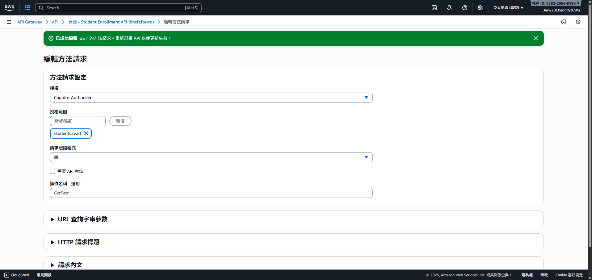
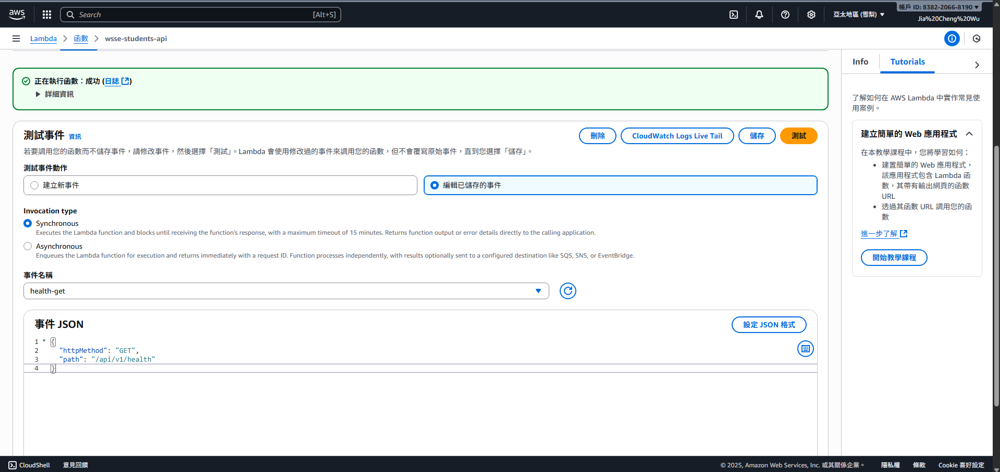
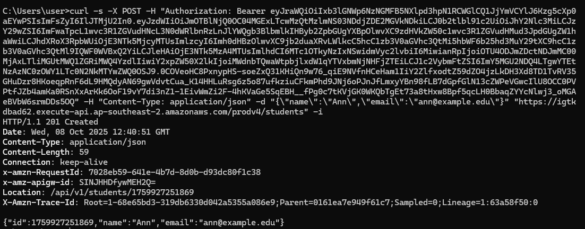

1. API資源樹  
  

2. Integration (GET /students -> Lambda)  
  

3. Integration (POST /students -> Lambda)  

4. Integration (GET /health -> Lambda)  
  

5. CORS(/students已啟用)  
  

6. Stage=prod/Invoke URL  
  

7. Authorizer設定 (Cognito)  
  

8. Method Request Scopes (GET=students.read)  
  

9. Method Request Scopes (POST=students.write)   

10. Lambda測試事件A (GET /health -> 200)  
  

11. Lambda測試事件B (POST /students -> 201 + Location)  
  

12. CloudWatch Logs  
  

12-1. 411177034-logs-1  
  

12-2. 411177034-logs-2  
  

12-3. 411177034-logs-3  

