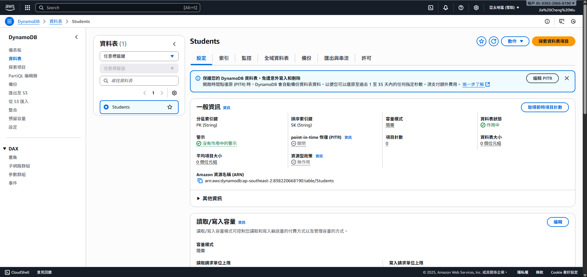
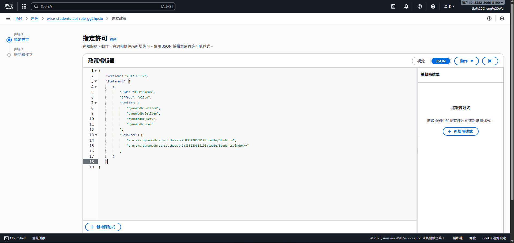
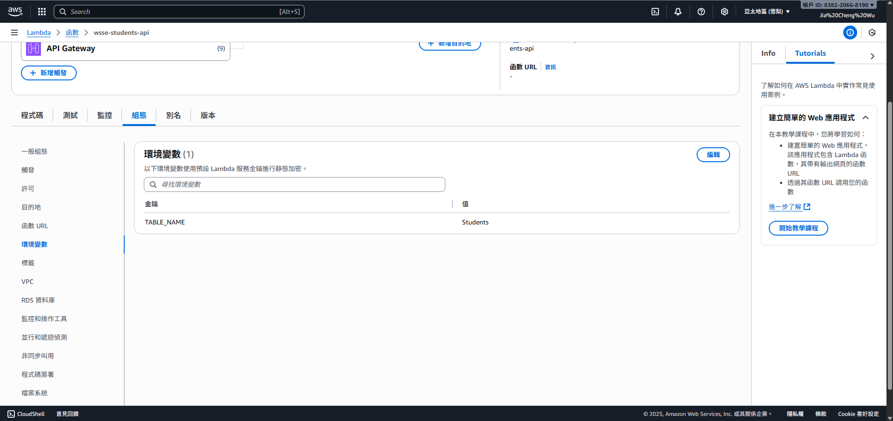
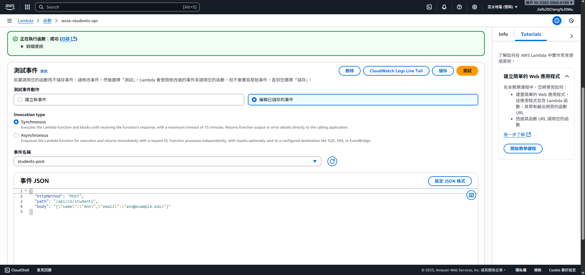
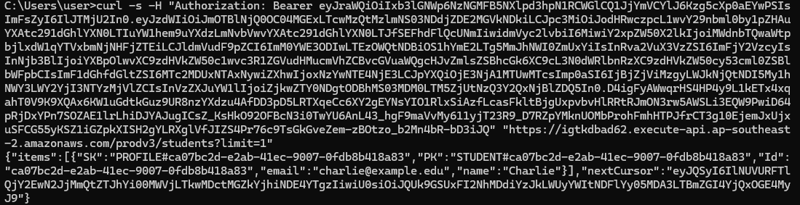
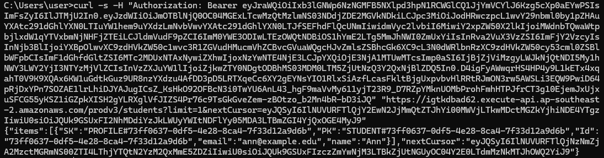

1. DynamoDB畫面  
  

2. IAM Inline Policy JSON  
  

3. Lambda設定(Runtime/ENV)  
  

4. Lambda測試事件POST成功  
  

5. API POST 201 + Location   
  

6. API GET 200 + items + nextCursor  
  

7. API GET 續頁  
  

8. CloudWatch Logs(RequestID對照)  
  
