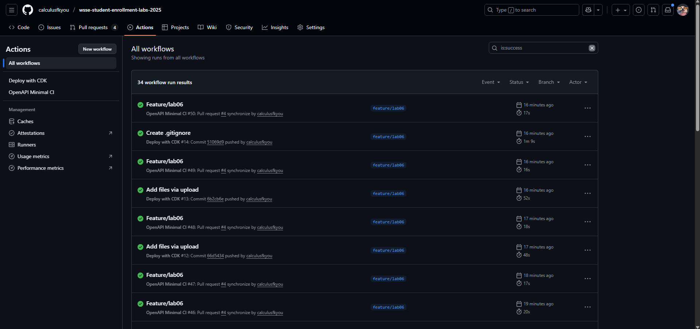
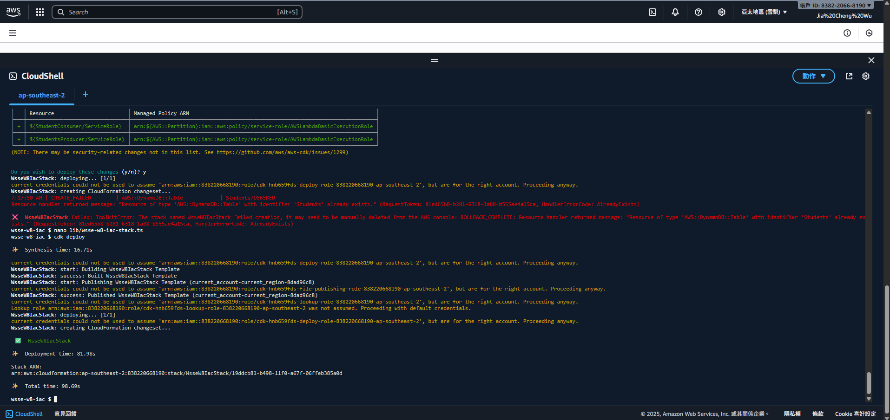
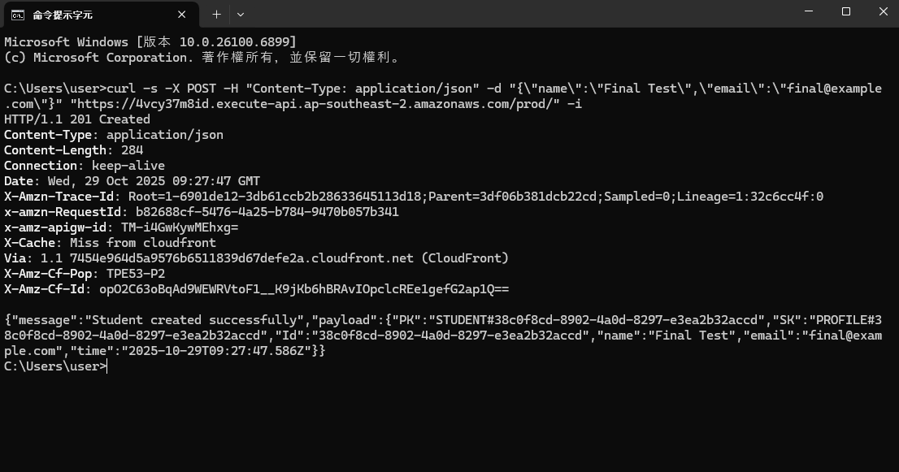
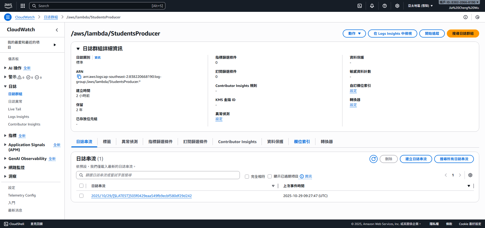
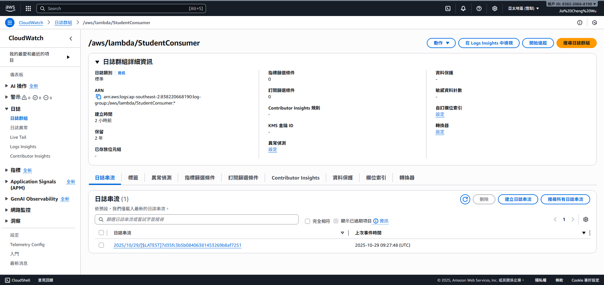

1. 411177034-actions-success.png  
  

2. 411177034-cdk-deploy.png  
  

3. 411177034-ddb-table.png  
  

4. 411177034-sns-topic.png  
  

5. 411177034-sqs-queue.png   
  

6. 411177034-lambda-producer.png  
  

7. 411177034-lambda-consumer.png  

8. 411177034-post-201.png  

9. 411177034-logs.png  

10. 411177034-logs.png  
  
