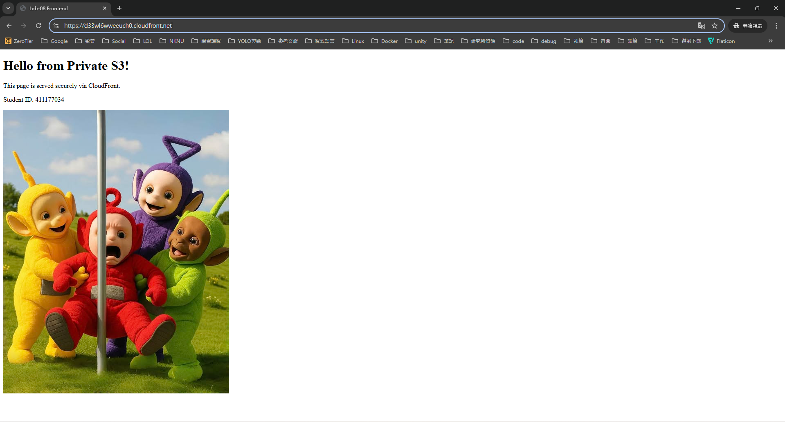
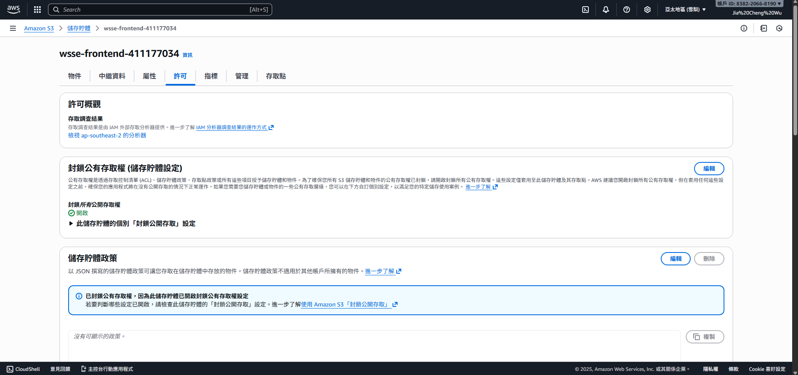
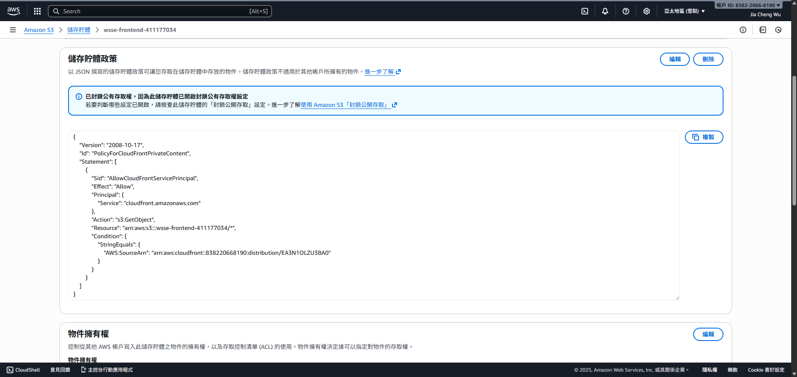

1. index.html
   ```html
   <!DOCTYPE html>
   <html lang="en">
   <head>
       <meta charset="UTF-8">
       <title>Lab-08 Frontend</title>
   </head>
   <body>
       <h1>Hello from Private S3!</h1>
       <p>This page is served securely via CloudFront.</p>
       <p>Student ID: 411177034</p>
       
   
       <script>
           const imageUrl = 'https://d33wl6wweeuch0.cloudfront.net/image.jpg'; 
           fetch(imageUrl)
               .then(response => response.blob())
               .then(blob => {
                   const objectURL = URL.createObjectURL(blob);
                   document.getElementById('myImage').src = objectURL;
               })
               .catch(error => console.error(error));
       </script>
   </body>
   </html>
   ```
2. 截圖A：瀏覽器成功畫面  
   
3. 截圖B：S3權限設定  
   
4. 截圖C：S3 Bucket Policy  
   
